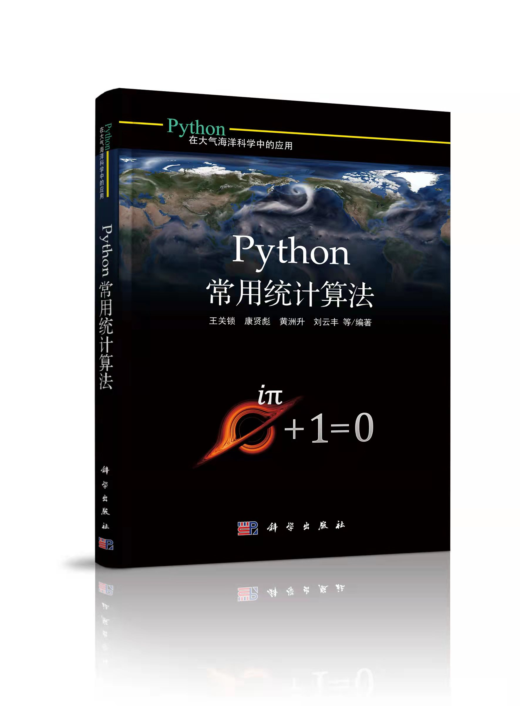

# Python 在大气海洋中的应用之 Python 常用统计算法应用示例

---

## 准备

安装对应科学环境（推荐使用`conda`，并使用`3.7`或以上版本）
> conda create -n qb python=3.7
> 
> conda install numpy scipy matplotlib pandas
> 
> conda install -c conda-forge statsmodels
> 
> pip install queensbarry 

如果想使用`qb`模块中的地理信息库需要先安装`shapely`：
> conda install -c conda-forge shapely

## 示例
- [ ] 第四章
- [ ] 第五章
- [x] 第六章
- [ ] 第七章
- [ ] 第八章
- [ ] 第九章
- [ ] 第十章
- [ ] 第十一章
- [ ] 第十二章
- [ ] 第十三章
- [ ] 第十四章
- [ ] 第十五章
- [ ] 第十六章
- [ ] 第十七章
- [ ] 第十八章
- [ ] 第十九章
- [ ] 第二十章
- [ ] 第二十一章